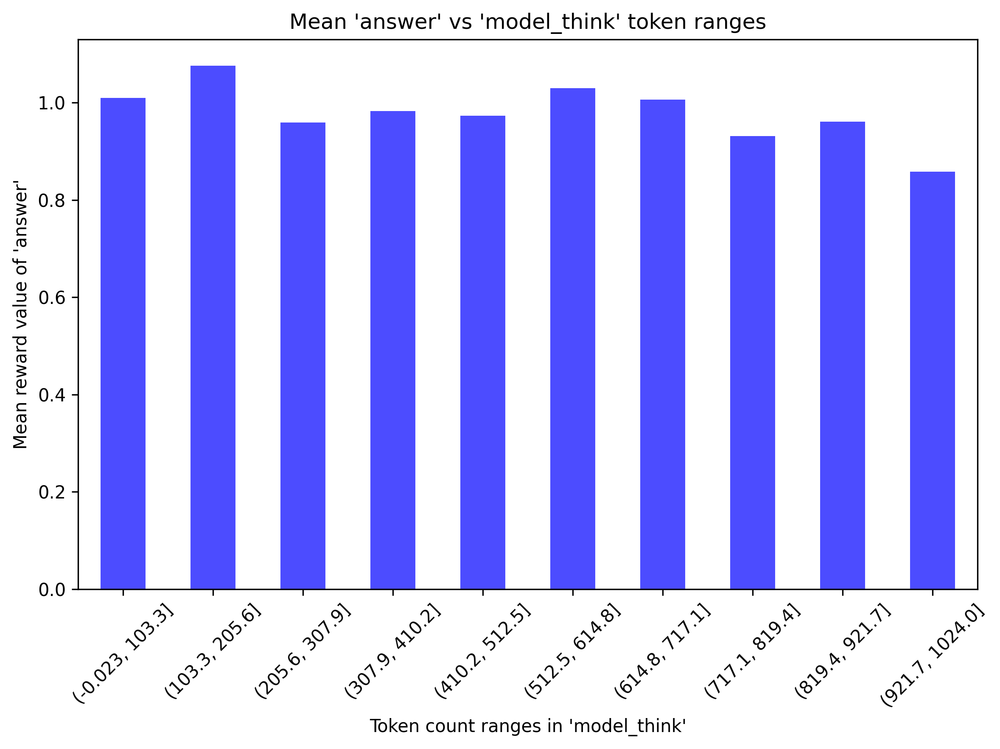
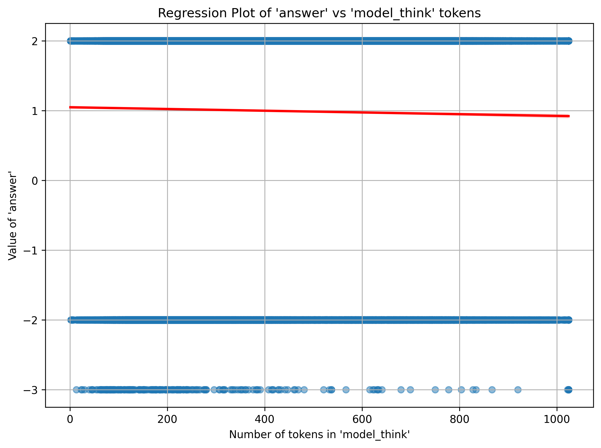

# DeepEnlighten: Generalization from EQ to IQ

**DeepEnlighten** is a lightweight replication study of the [DeepSeek-R1-Zero](https://github.com/deepseek-ai/DeepSeek-R1) framework. This project investigates the use of **pure reinforcement learning (RL)** without supervised fine-tuning (SFT) to post-train base models for **social reasoning capabilities**. 

It leverages the following key components:

1. RL Framework: **[verl](https://github.com/volcengine/verl)**
2. RL Algorithms: **[REINFORCE++](https://arxiv.org/html/2501.03262v1)**
3. RL Dataset: **[Social IQa](https://arxiv.org/abs/1904.09728)**
4. Base Models: **Qwen2.5** (3B), **Llama3.2** (3B)
5. Math Evaluation: **[DeepSeek-Math](https://github.com/deepseek-ai/DeepSeek-Math)**

---

## Dataset

**Social IQa**: 
- Designed to probe **emotional and social intelligence** in everyday scenarios.
- Example:  
  - Q: "Jordan wanted to tell Tracy a secret, so Jordan leaned towards Tracy. Why did Jordan do this?"  
  - A: "To make sure no one else could hear."

---

## Rule-Based Rewards
1. **Format Reward**: +2 if valid, -2 if invalid.  
2. **Answer Reward**: +2 if correct, -2 if incorrect, -3 if invalid.  
3. Language Consistency Reward or Others: not applied. 

---

## Training
After configuring your WandB, GPUs, and other settings, execute the training:  
```bash
bash run_rl_trainer_xxx.sh
```

---

## Key Findings

For details, refer to:

- **[DeepEnlighten Training Report](https://api.wandb.ai/links/yuwang91-hk/eyclicwc)**  
- **`analysis` Directory**: Contains log analysis of CoT, language mixing, and "aha moment".  
- **`evaluation` Directory**: Contains evaluation results on math benchmarks.

---

### 1. **Generalization from EQ to IQ**

- Social reasoning can **generalize to out-of-distribution (OOD) tasks** requiring mathematical reasoning.

#### Table: Accuracy in Mathematical Reasoning CoT Tests 
*(Base Model = Llama3.2-3B-Instruct, 1000 Steps RL, Number of Samples in Parenthesis)*

| Task               | DeepEnglighten-3B | Llama3.2-3B-Instruct |
|--------------------|--------------------------------------|----------------------------|
| math-cot-test      | 0.4419 (3750)                       | 0.2672 (3750)              |
| cmath-cot-test     | 0.5995 (824)                        | 0.5480 (823)               |
| gsm8k-cot-test     | 0.7576 (330)                        | 0.7660 (329)               |

---

### 2. **Longer CoT is Not Always Present**
- **Longer CoT** does not consistently appear across different experiments.
- Longer CoT likely emerges **only when the task is challenging**, as the model may resort to memorization rather than true reasoning.
- Further experiments are required to validate this observation.  

---

### 3. **Longer CoT ≠ Higher EQ**
- While CoT becomes longer and the mean rewards increase, longer CoT does not correlate with higher accuracy.
- This aligns with **superficial self-reflection** findings from [OAT-ZERO](https://github.com/sail-sg/oat-zero).

#### Figures (Base Model = Llama3.2-3B-Instruct):
- Left Figure: Answer accuracy versus token count distribution.  
- Right Figure: Regression analysis of accuracy against token count.  

<div style="display: flex; justify-content: space-between; gap: 1px;">





</div>

---

### 4. **Language Mixing Does Exist**
- While **language mixing** is observed, it is not prevalent.  
- Example: "购买电影票是娱乐的行为，是一种人性性行为，反映了人 Seekingjoy, pleasure and entertainment's需要。"

#### Table: Language Distribution in Model Thinking 
*(Base Model = Llama3.2-3B-Instruct)*

| Category               | Count | Percentage |
|------------------------|-------|------------|
| Only English           | 96674 | 98.23% |
| Only Chinese           | 0 | 0.00% |
| Mixed (English & Chinese) | 1727 | 1.75% |

---

## Acknowledgements

This project builds upon and references several open-source works:

- **[Logic-RL-Lite](https://github.com/DolbyUUU/Logic-RL-Lite)**: Reproduction of R1-Zero on logic puzzles.
- **[verl Framework](https://github.com/volcengine/verl)**: Reinforcement learning framework.
- **[DeepSeek-Math](https://github.com/deepseek-ai/DeepSeek-Math)**: Mathematical reasoning benchmarks.
- **[Social IQa Dataset](https://github.com/AlphaPav/mem-kk-logic)**: Social reasoning dataset.